# MongoDB Test for IBM Cloud Private

This is a test client app that attempts to communicate with the MongoDB service/server in the IBM Private Cloud.

## Installing the App

Clone the repository using `git clone git@github.com:Samleo8/mongo-icp-test.git` or `git clone https://github.com/Samleo8/mongo-icp-test.git`


## Running the App

0. Set up [IBM Cloud Private](https://www.ibm.com/support/knowledgecenter/en/SSBS6K_1.2.0/kc_welcome_containers.html). I used Vagrant as per the instructions [here](https://github.com/IBM/deploy-ibm-cloud-private/blob/master/docs/deploy-vagrant.md).

1. Configure IBM Cloud Private (via the IBM Cloud Private console) to run a MongoDB service that is accessible by a client. See [Database Setup](#database-setup) below for instructions.

	You can further [manage](#managing-your-mongodb-helm-release) it from the IBM Console.

2. Once all is setup, install dependencies using `npm install`.

3. Make sure the master node is up and running. If you used vagrant like I did, run `vagrant up`.

	You might need to wait (quite) a while before the MongoDB pod becomes available.

4. Configure your client. ~Use the script in `scripts/configure_client.sh`, and edit the `SERVER` variable accordingly.~ You have to go into the GUI and on the top right corner click the Profile icon and follow the instructions after clicking **Configure Client**.

5. Start the app with `npm start`. The password will be automatically retrieved from `kubectl` and IBM Cloud secrets, and will remain hidden to the client (and actually also to you). The host and port variables are also automatically setup.

	Other commands include `npm run dev` (testing) and `npm run noserver` (simulate with fake data).

	Using [mongo-express](https://github.com/mongo-express/mongo-express), you can also further manage the database and/or collections. More instructions [below](#managing-using-mongo-express).

## Using the App
The app aims to demonstrates 3 functions:
1. Adding of entries into the database's collection:

	*Enter your name and vote for your favorite animal!*
	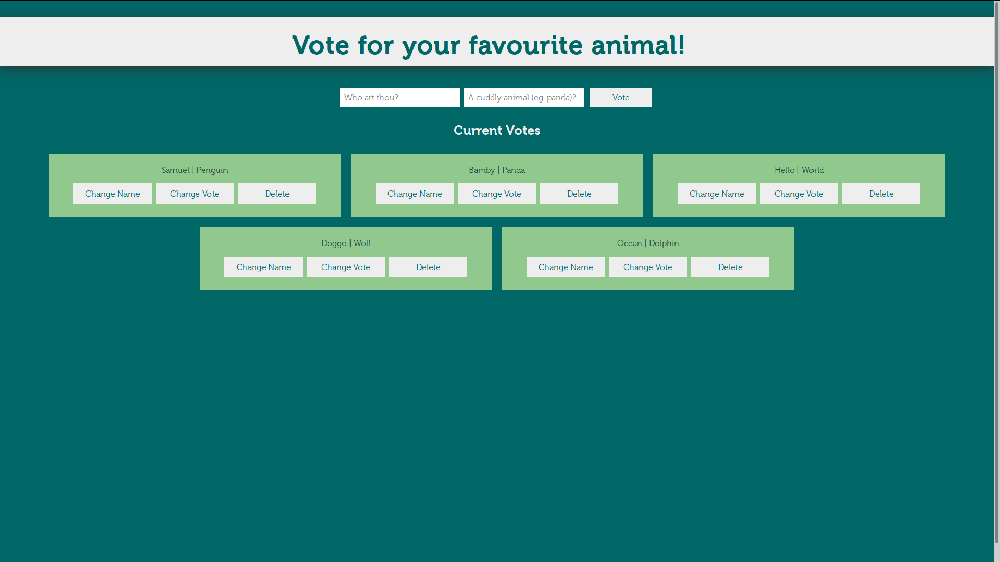

2. Modifying specific entries

	*You can then change your vote or your name by clicking on a button, and a pop-up will appear.*
	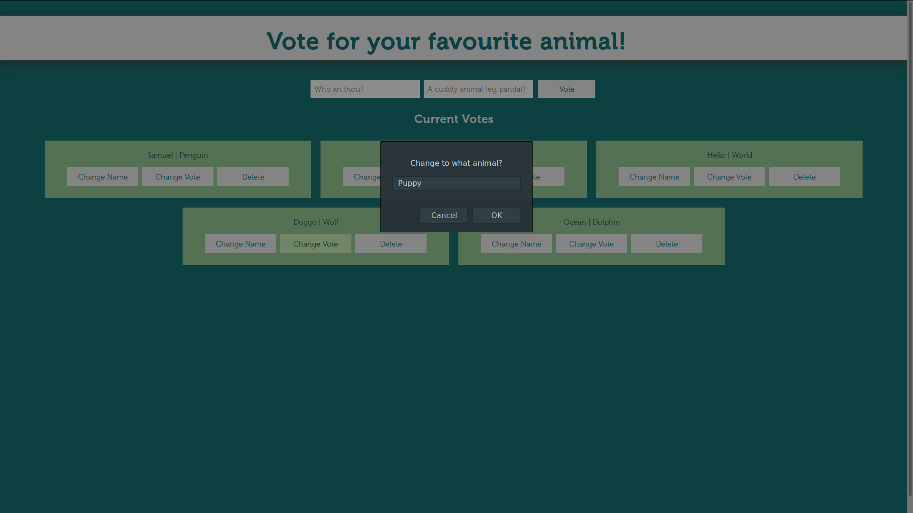

3. Deleting specific entries

	*You can then delete your vote by clicking on the delete button*

	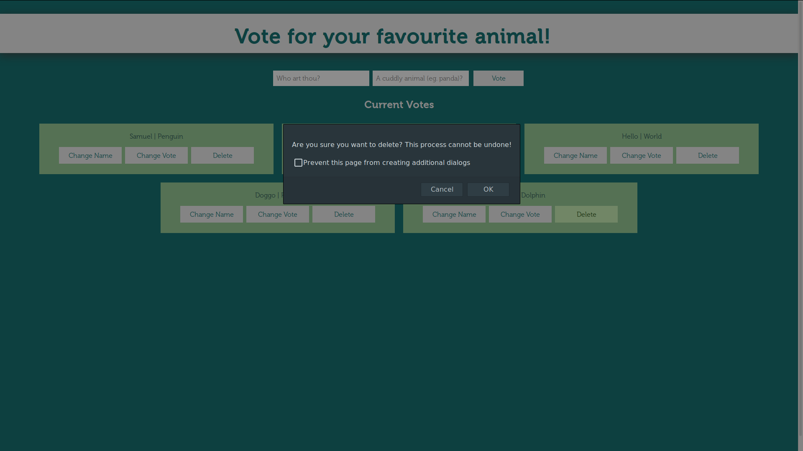
	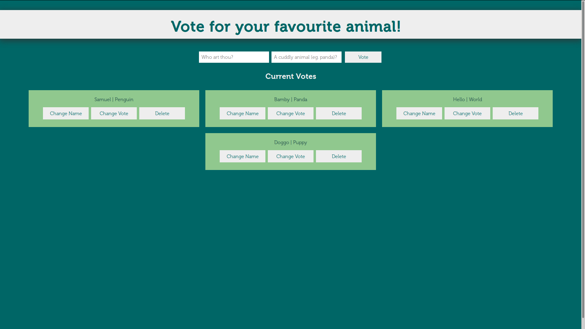

## Database Setup

There seems to be 2 methods to setup the MongoDB service on IBM Cloud Private:
 - [GUI](#gui-method)
 - [Command Line](#command-line)

### GUI Method
First find out where you IBM web console is. If you used the Vagrant setup, it should be in the output with the "happy dance".

For example, my console is hosted at https://192.168.31.100:8443/console. If you did not change the `base_setting` in the Vagrantfile like I did, then yours should be https://192.168.27.100:8443/console by default.

1. Login with your username and password, as set in the `Vagrantfile`

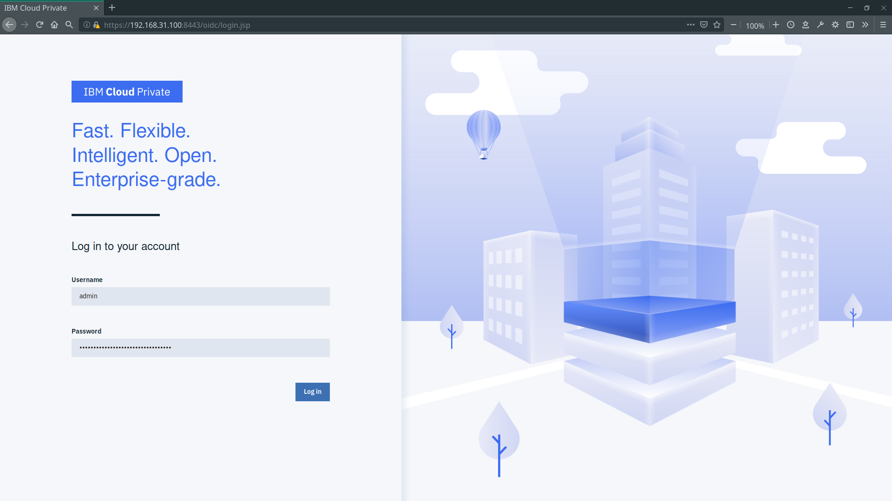

2. Once in, click the **Catalog** button on the top right corner of the page. This will lead you to a Catalog page containing all the included Helm repositories. Search for "***mongodb***" and click on the repository named **ibm-mongodb-dev**

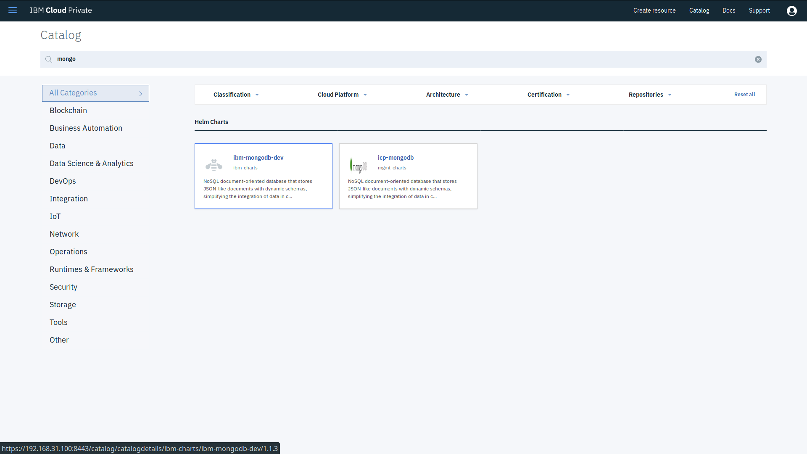

3. You will then be able to configure the MongoDB dev service. Give it a release name (in my case it is ***dbtest***), a target namespace (***default*** is fine), and check the necessary boxes.

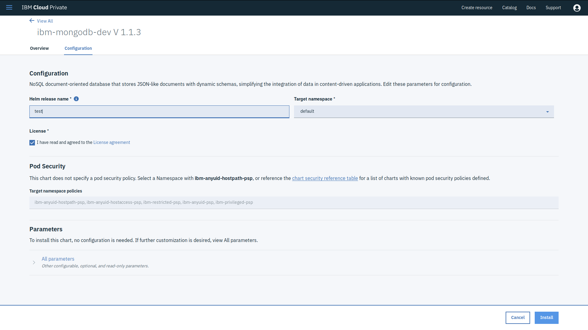

4. We need to make sure that the MongoDB service is accessible outside of the Master node (i.e. an external client must be able to access it). Thus, we need to make sure that the configuration is set as **NodePort** and **NOT** *ClusterIP*.

	To do this, click **Parameters** > *All Parameters* and then scroll down to the part that says **Service configuration** and make sure that **Service Type** is set to **NodePort**.

	Refer to the screenshot below:

	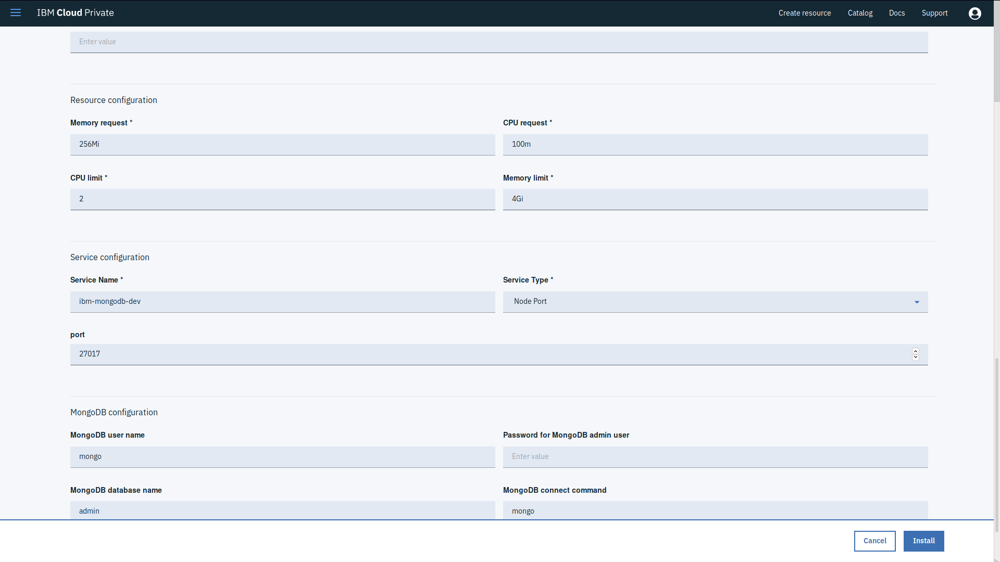

5. We also need to set a password for our administrator. Below **Service Configuration** is a segment that says **MongoDB Configuration** > **Password for MongoDB Admin User**. You are advised to set a strong one; the password is saved in your secrets file and automatically setup from there anyway.

	Refer to the screenshot below:


6. Click **Install** and you should be done! You can now click on the *View Helm Release* button to view your release. Alternatively see [Managing your MongoDB Helm Release](#managing-your-mongodb-helm-release).

### Command Line
1. Using Vagrant, ssh into the **master node** using the `vagrant ssh` command.

2. Run the script in `scripts/config_helm.sh` to configure your helm. Do this in the **master node**.

	This script aims to solve the error whereby the helm repo for `stable` was wrongly put as `https://kubernetes-charts.storage.googleapis.com` when it should have been `https://raw.githubusercontent.com/IBM/charts/master/repo/stable`

3. In the master node, you can install the mongodb with name `dbtest` and password `password123` as below:
	```bash
	helm install --name dbtest --set service.type=NodePort,database.password=password123 stable/ibm-mongodb-dev --tls
	```

	More generally,
	```bash
	helm install --name <name-of-release> --set service.type=NodePort,database.name=<database-name(default:admin)>,database.password=<database-password> stable/ibm-mongodb-dev
	```

	Remember to set `service.type=NodePort`

	*NOTE: Because of issues with signing of the certificates, you need to add `--tls` to the end of every helm command*

## Managing your MongoDB Helm Release

### Overall Management

1. To manage your MongoDB service, click the hamburger menu in the top left corner, and go to **Workloads** > **Helm Releases**

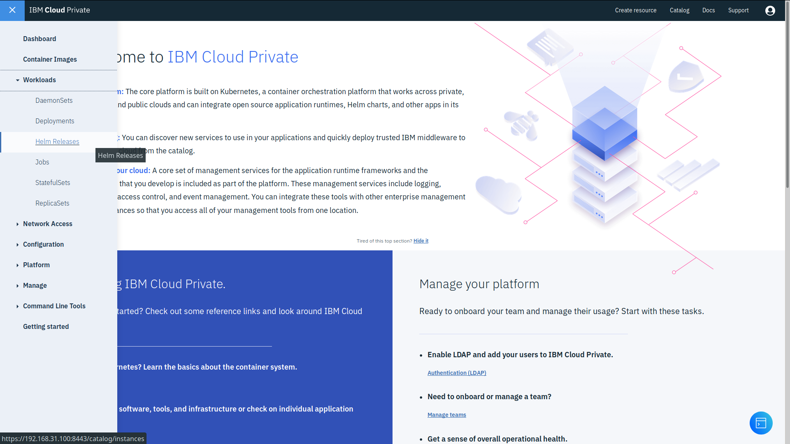

2. Search for the name of your release (mine was **dbtest**)
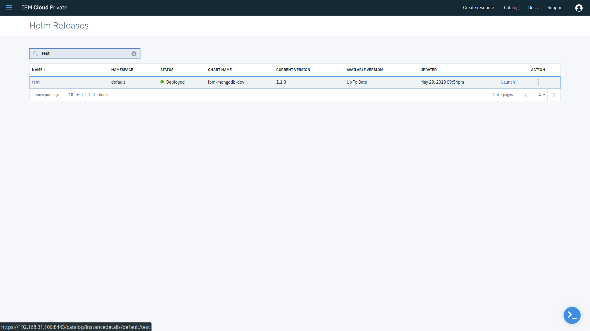

3. Click on the link to get an overall view of your running release.

	Here, you can get information about [Deployment](#deployment), [Service](#service) and other notes

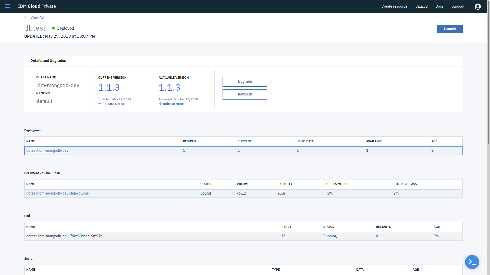

### Deployment
This section allows you to manage and see your release as a kubernetes deployment. It shows you "**ReplicaSets**" (which I take to be kubernetes pods; you can have more than 1 if you want).

Note that you might have to wait a while for the deployment to turn from *`available`*` = 0` to *`available`*` = 1` before you can use the service.

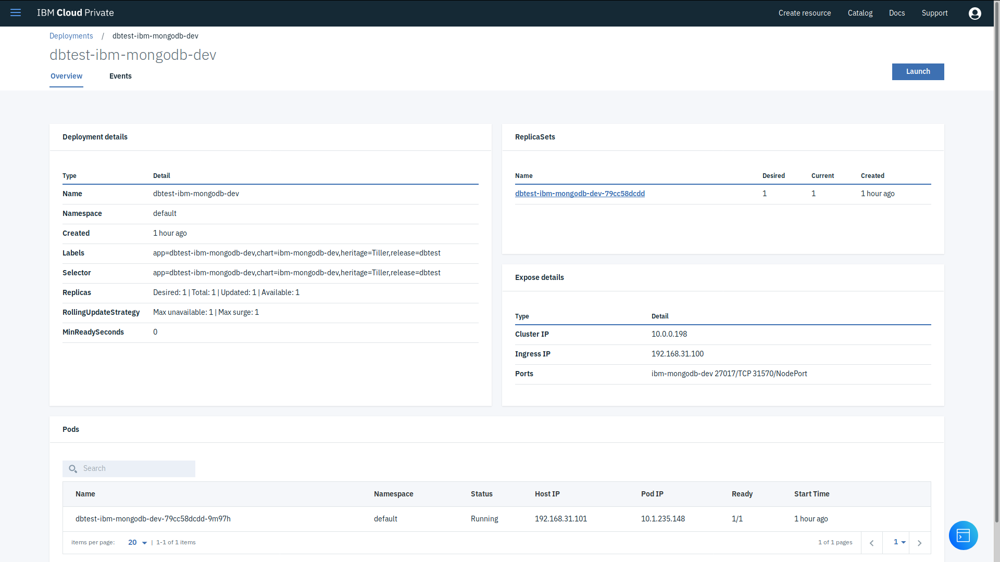

*NOTE: Also accessible from the **Workloads** > *Deployments** tab of the hamburger menu*

### Service
This table contains more information about your MongoDB service, in particular the internal localhost port and the external port (which will be used by the client to access).

The *Notes* portion in the screenshot below will help you to [configure the npm start script](#configuring-the-npm-start-script) if you need to.

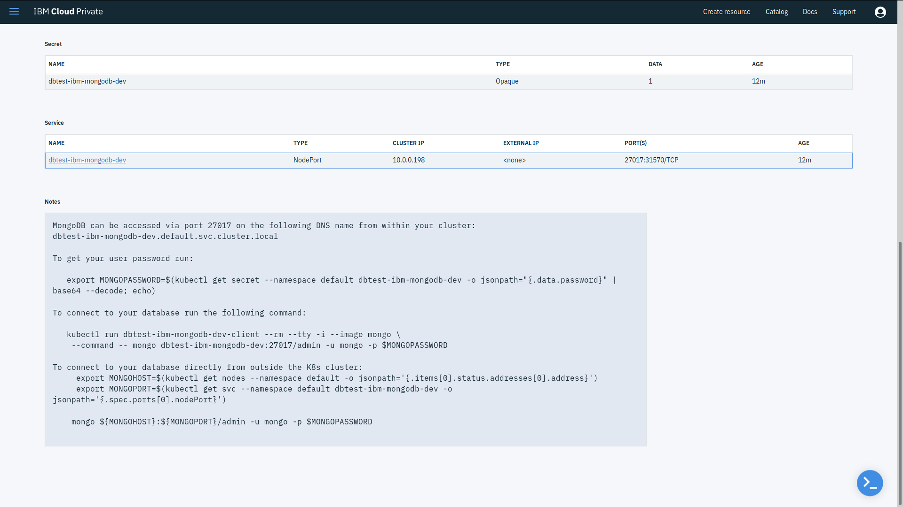

*NOTE: Also accessible from the **Network Access** > **Services** tab of the hamburger menu*

## Managing using Mongo Express

It is also possible to fully manage your database and their collections using [Mongo Express](https://github.com/mongo-express/mongo-express).

### Installation and Configuration

Install `mongo-express` using `npm install -g mongo-express`.

*If you want to change the local configuration:*

Copy `/usr/local/lib/node_modules/mongo-express/config.default.js` into a new file called `/usr/local/lib/node_modules/mongo-express/config.js`. `/usr/local/lib` might be different, depending on where npm installs `mongo-express`.

Change the settings in the `config.js` file accordingly.

### Running the Mongo Express GUI Manager
You can use this command to start the GUI manager.
```bash
mongo-express -a -u mongo \
	-p $(kubectl get secret --namespace default dbtest-ibm-mongodb-dev -o jsonpath='{.data.password}' | base64 --decode; echo) \
	-H $(kubectl get nodes --namespace default -o jsonpath='{.items[0].status.addresses[0].address}') \
	-P $(kubectl get svc --namespace default dbtest-ibm-mongodb-dev -o jsonpath='{.spec.ports[0].nodePort}')
```

Then go to `https://localhost:8081` (the default URL) and start using the GUI manager!

## Configuring the npm start script
While you could just run `npm start` and see how it goes, you might want to modify the start script according to your setup above.

Depending on what you put as the release name (it is `dbtest` by default), you have to edit the `package.json`'s `start` command accordingly.

For example, if your release name is `mydb` (mine is `dbtest`), replace all occurences of `dbtest-ibm-mongodb-dev` with `mydb-ibm-mongodb-dev`. If you changed the namespace, you will need to change it from `default` to something else as well.

Alternatively, just replace the `start` command with whatever is shown when you view `ibm-mongodb-dev` in the **Helm Releases** section, which you can access by following the instructions [here](#service):

```
export MONGOPASSWORD=$(kubectl get secret --namespace default dbtest-ibm-mongodb-dev -o jsonpath="{.data.password}" | base64 --decode; echo)
export MONGOHOST=$(kubectl get nodes --namespace default -o jsonpath='{.items[0].status.addresses[0].address}')
export MONGOPORT=$(kubectl get svc --namespace default dbtest-ibm-mongodb-dev -o jsonpath='{.spec.ports[0].nodePort}')
```

## References
Some code based off the awesome tutorial here: https://zellwk.com/blog/crud-express-mongodb/
